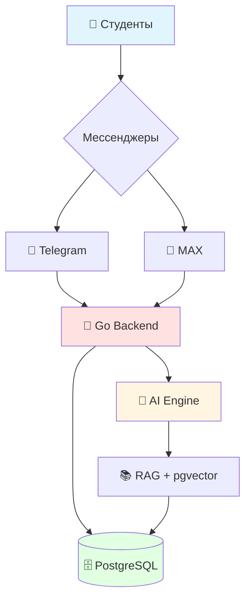

<div align="center">

# 🎓 AI Student Assistant

<p align="center">
  
  
  
</p>

<p align="center">
  <strong>Интеллектуальная мультимессенджерная система поддержки образовательного процесса</strong>
</p>

<p align="center">
  <a href="#-возможности">Возможности</a> •
  <a href="#-быстрый-старт">Быстрый старт</a> •
  <a href="#-архитектура">Архитектура</a> •
  <a href="#-документация">Документация</a> •
  <a href="#-участие-в-разработке">Участие</a>
</p>

<p align="center">
  
  
  
  
</p>

</div>

---

## 📖 О проекте

**AI Student Assistant** — это единая система, через которую студент может быстро получать информацию, связанную с образовательным процессом, непосредственно в привычном мессенджере.

### 🎯 Основная идея

> Не просто предоставить студенту информацию, а сделать её **максимально доступной**, **структурированной** и **понятной**.

### ❓ Какую проблему решаем?

Сейчас информация разбросана по множеству источников:
- 📅 Расписание в разных системах
- 📧 Сообщения преподавателей
- 📂 Документы и файлы
- 💬 Чаты групп
- 🏫 Информация о кабинетах

**Студенту приходится тратить время на поиск**, переключаясь между платформами.

### ✨ Наше решение

Единая точка доступа ко всей образовательной информации через **Telegram** или **MAX**.

```
Студент → Мессенджер → AI Assistant → Актуальная информация ✓
```

---

## 🚀 Возможности

<table>
<tr>
<td width="50%">

### 📅 Базовые функции
- ✅ Расписание занятий
- ✅ Замены и изменения
- ✅ Информация о кабинетах
- ✅ Данные о преподавателях
- ✅ Push-уведомления

</td>
<td width="50%">

### 🤖 AI-возможности (в разработке)
- 🔄 Выжимки лекций
- 🔄 Объяснение материала
- 🔄 Ответы на вопросы
- 🔄 Поиск по материалам
- 🔄 Персональный помощник

</td>
</tr>
</table>

---

## 🎬 Демонстрация

<div align="center">

### Взаимодействие с ботом

```
👤 Студент: "Какая завтра первая пара?"

🤖 Бот:
📅 Расписание на 20.09.2026
Группа: 25ИТ26

1. 08:30 — Базы данных
   👨‍🏫 Иванов И.И.
   🏫 Кабинет 312 (3 этаж, главный корпус)

2. 10:20 — Программирование
   👨‍🏫 Петрова А.В.
   🏫 Кабинет 205 (2 этаж)
```

### Уведомления об изменениях

```
⚠️ Изменение расписания

📅 20.09.2026, 3 пара
📚 Базы данных

Было: кабинет 312
Стало: кабинет 408

Преподаватель без изменений.
```

</div>

---

## 🏗️ Архитектура

<div align="center">



</div>

### 📁 Структура проекта

```
go_tele_bot/
├── 📂 bot/              # Настройки бота
├── 📂 handlers/         # Обработчики событий
│   ├── commands.go      # Команды (/start, /help)
│   ├── messages.go      # Текстовые сообщения
│   └── callbacks.go     # Callback-кнопки
├── 📂 keyboards/        # Клавиатуры
├── 📂 database/         # Работа с БД (планируется)
├── 📂 ai/               # AI модуль (планируется)
├── 📄 main.go           # Точка входа
└── 📄 .env.example      # Пример конфигурации
```

---

## ⚡ Быстрый старт

### Предварительные требования

- **Go** 1.27+ ([установить](https://go.dev/dl/))
- **Git** ([установить](https://git-scm.com/downloads))
- **Telegram Bot Token** ([получить](https://t.me/BotFather))

### 🔧 Установка

<details>
<summary><b>Шаг 1: Клонирование репозитория</b></summary>

```bash
git clone https://github.com/yourusername/go_tele_bot.git
cd go_tele_bot
```

</details>

<details>
<summary><b>Шаг 2: Установка зависимостей</b></summary>

```bash
go mod download
```

</details>

<details>
<summary><b>Шаг 3: Настройка окружения</b></summary>

Создайте файл `.env` на основе примера:

```bash
cp .env.example .env
```

Откройте `.env` и добавьте ваш токен:

```env
TELEGRAM_BOT_TOKEN=your_bot_token_here
```

> 💡 Получить токен можно у [@BotFather](https://t.me/BotFather)

</details>

<details>
<summary><b>Шаг 4: Запуск</b></summary>

```bash
go run main.go
```

Вы должны увидеть:
```
Bot started: @YourBotName
```

</details>

---

## 🔮 Roadmap

<table>
<tr>
<td>

### ✅ Этап 1: Core (выполнено)
- [x] Инициализация проекта
- [x] Telegram Bot API
- [x] Polling система
- [x] Базовые handlers
- [x] Inline-клавиатуры

</td>
<td>

### 🔄 Этап 2: Education (в процессе)
- [ ] Система расписания
- [ ] Выбор группы
- [ ] Информация о кабинетах
- [ ] Отслеживание замен
- [ ] Push-уведомления

</td>
</tr>
<tr>
<td>

### 📋 Этап 3: Database
- [ ] PostgreSQL интеграция
- [ ] Модели данных
- [ ] Миграции
- [ ] User management
- [ ] Хранение расписаний

</td>
<td>

### 🤖 Этап 4: AI Features
- [ ] Обработка документов
- [ ] RAG система
- [ ] Векторный поиск (pgvector)
- [ ] Выжимки лекций
- [ ] Q&A по материалам

</td>
</tr>
</table>

---

## 🛠️ Технологический стек

<div align="center">

| Технология | Назначение | Статус |
|:----------:|:-----------|:------:|
|  | Backend & Business Logic | ✅ |
|  | Мессенджер интеграция | ✅ |
|  | База данных | 📋 |
|  | Векторный поиск | 📋 |
|  | Контейнеризация | 📋 |

</div>

---

## 📚 Документация

### 📖 Содержание

- [🏗️ Архитектура проекта](./docs/ARCHITECTURE.md)
- [⚙️ Конфигурация](./docs/CONFIGURATION.md)
- [🔌 API Reference](./docs/API.md)
- [🗄️ Модели данных](./docs/DATABASE.md)
- [🤖 AI модуль](./docs/AI.md)
- [🧪 Тестирование](./docs/TESTING.md)
- [🚀 Деплой](./docs/DEPLOYMENT.md)

### 🎓 Для разработчиков

- [👨‍💻 Начало работы](./CONTRIBUTING.md)
- [📝 Стиль кода](./docs/CODE_STYLE.md)
- [🌿 Git workflow](./docs/GIT_WORKFLOW.md)
- [🔍 Отладка](./docs/DEBUGGING.md)

---

## 👥 Участие в разработке

Мы приветствуем вклад в развитие проекта! 

### 🤝 Как помочь проекту?

1. 🌟 Поставьте **Star** проекту
2. 🐛 Сообщите об ошибке в [Issues](https://github.com/yourusername/go_tele_bot/issues)
3. 💡 Предложите новую функцию
4. 🔧 Отправьте Pull Request

### 📋 Процесс контрибуции

Подробная информация в [CONTRIBUTING.md](./CONTRIBUTING.md)

Краткая инструкция:

```bash
# 1. Форкните репозиторий
# 2. Создайте ветку для feature
git checkout -b feature/amazing-feature

# 3. Сделайте изменения и закоммитьте
git commit -m "feat: add amazing feature"

# 4. Отправьте в ваш fork
git push origin feature/amazing-feature

# 5. Откройте Pull Request
```

### 💻 Команда разработки

<div align="center">

<table>
<tr>
<td align="center">
<a href="https://github.com/devskyyy">

<br />
<sub><b>devskyyy</b></sub>
</a>
<br />
<sub>Backend Developer</sub>
</td>
<td align="center">
<a href="https://github.com/pupsmane">

<br />
<sub><b>pupsmane</b></sub>
</a>
<br />
<sub>Backend Developer</sub>
</td>
</tr>
</table>

</div>

---

## 📊 Статистика проекта

<div align="center">


</div>

---

## 📄 Лицензия

Проект разрабатывается в образовательных и исследовательских целях.

Подробности в [LICENSE](./LICENSE).

---

## 🙏 Благодарности

- [go-telegram-bot-api](https://github.com/go-telegram-bot-api/telegram-bot-api) - Telegram Bot API для Go
- [godotenv](https://github.com/joho/godotenv) - Загрузка переменных окружения
- Всем участникам проекта и сообществу

---

## 📞 Контакты

<div align="center">

**Вопросы?** Создайте [Issue](https://github.com/yourusername/go_tele_bot/issues) или напишите нам!

[](https://t.me/devskyyu)
[](devidcopperfild-ae@yandex.ru)

</div>

---

<div align="center">

**[⬆ Вернуться наверх](#-ai-student-assistant)**

Made with ❤️ by **devskyyy** × **pupsmane**

<sub>Built with Go 🚀 | Powered by AI 🤖 | Made for Education 🎓</sub>

</div>
